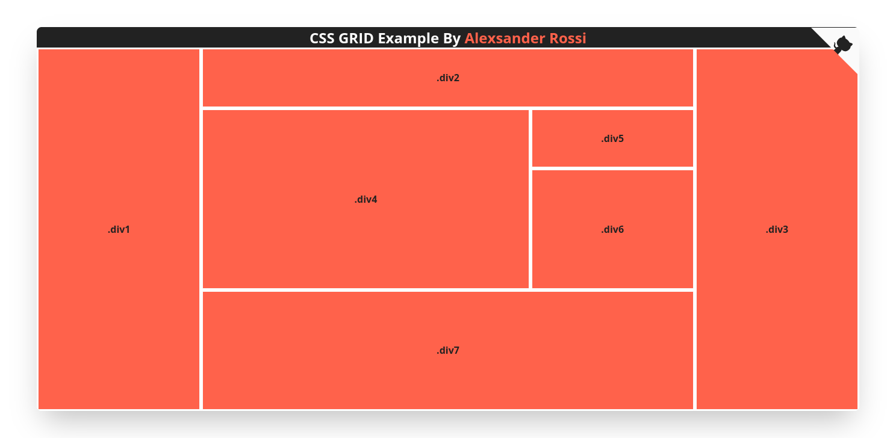

  

## CSS Grid Example
> Grid gerado pela ferramenta **cssgrid-generator**

Disponível nesse link: [CSS Grid Generator](https://cssgrid-generator.netlify.app/)

### O que é Grid?
> Grid é uma malha formada pela interseção de um conjunto de linhas horizontais e um conjunto de linhas verticais – um dos conjuntos define colunas e outro linhas. Dentro de um  grid, respeitando-se a configuração criada pelas suas linhas, pode-se inserir elementos da marcação.

Veja mais em: [Documentação CSS Grid Layout](https://developer.mozilla.org/pt-BR/docs/Web/CSS/CSS_Grid_Layout/Basic_Concepts_of_Grid_Layout)

##### Screenshot

---

 | |
--- |
[Alexsander Rossi](https://www.linkedin.com/in/4lex/) | [Matheus Brunelli](https://www.linkedin.com/in/mrbrunelli/)   
